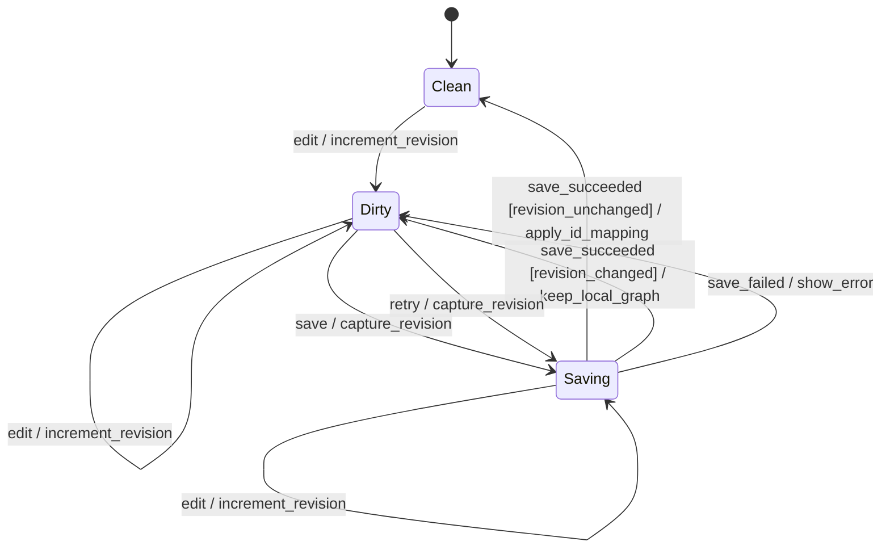

# GOAT: Go CV Annotation Tool - Design Document

## Overview

画像データセット作成のためのComputer Visionアノテーションアプリケーション。
帳票・ドキュメント画像は初期の重点ユースケースとして扱う。
非同期共同編集・事前推論を最終目標とし、まずは同期的・単一ユーザーで小さく始める。

### Target Domain

- **対象画像**: 一般的な画像。初期重点ユースケースは帳票、フォーム、請求書等のドキュメント画像
- **アノテーションタスク**:
  1. **Object Detection** — 画像内のオブジェクトをBBox/Polygonで検出
  2. **Reading Order** — オブジェクト間に有向エッジを貼り、読み順を定義（有向グラフ構造）
  3. **Table Analysis** — テーブル領域の検出とセル構造の定義（親子関係エッジ）
  4. **Information Extraction** — エンティティ領域にセマンティックラベル付与（例: 日付、金額、会社名）
  5. **KV Extraction** — Key領域とValue領域を検出し、対応関係をエッジで定義

## Tech Stack

| Category | Selection | ADR |
|----------|-----------|-----|
| Backend HTTP | Chi | [ADR-0001](adr/0001-go-http-framework.md) |
| Database / Query | SQLite + sqlc | [ADR-0002](adr/0002-database-and-query.md) |
| Canvas | Konva (react-konva) | [ADR-0003](adr/0003-canvas-library.md) |
| State Management | Zustand | [ADR-0004](adr/0004-state-management.md) |
| Styling | Tailwind CSS | [ADR-0005](adr/0005-styling.md) |
| Frontend Framework | React + Vite | - |
| Language | Go (backend) / TypeScript (frontend) | - |

## Architecture

```
┌─────────────────────────────────────────────────┐
│                   Frontend                       │
│  React + Vite                                    │
│  ┌───────────┐  ┌──────────┐  ┌──────────────┐  │
│  │  Toolbar   │  │ Sidebar  │  │ Annotation   │  │
│  │ (tools)    │  │ (images, │  │ Canvas       │  │
│  │            │  │  labels) │  │ (Konva)      │  │
│  └───────────┘  └──────────┘  └──────────────┘  │
│         │              │              │          │
│         └──────────────┼──────────────┘          │
│                        │                         │
│                  Zustand Store                    │
└────────────────────────┼─────────────────────────┘
                         │ REST API (JSON)
┌────────────────────────┼─────────────────────────┐
│                   Backend                        │
│  Go + Chi                                        │
│  ┌──────────┐  ┌──────────┐  ┌──────────────┐   │
│  │ Handler  │→ │ Usecase  │→ │ Repository   │   │
│  │ (HTTP)   │  │ (Logic)  │  │ (SQLite/sqlc)│   │
│  └──────────┘  └──────────┘  └──────────────┘   │
│                                      │           │
│                              ┌───────┴────────┐  │
│                              │ SQLite   Local  │  │
│                              │ (.db)    FS     │  │
│                              └────────────────┘  │
└──────────────────────────────────────────────────┘
```

### Backend Layers

| Layer | Responsibility |
|-------|---------------|
| **Handler** | HTTPリクエスト/レスポンス変換、バリデーション |
| **Usecase** | ビジネスロジック、複数Repositoryの協調 |
| **Repository** | データ永続化、SQLクエリ実行 |
| **Domain** | ドメインモデル定義（他レイヤーに依存しない） |

依存方向: Handler → Usecase → Repository(interface) ← Repository(impl)

## Domain Model

```
Project 1 ---* LabelDefinition
   |                |
   ├─ id            ├─ id
   ├─ name          ├─ name (e.g. "header", "invoice_number", "table")
   └─ created_at    ├─ color
                    └─ category: "object" | "entity" | "key" | "value" | "table" | "cell"

Project 1 ---* Guideline
   |                |
   |                ├─ id
   |                ├─ title
   |                ├─ body (Markdown)
   |                ├─ display_order
   |                └─ updated_at

Project 1 ---* Image 1 ---* Annotation
                  |         |    |
                  ├─ id     |    ├─ id
                  ├─ file   |    ├─ type: "bbox" | "polygon"
                  ├─ original_width  |  ├─ coordinates: JSON (normalized, post-transform space)
                  ├─ original_height |  ├─ label_id → LabelDefinition
                  ├─ width  |    └─ created_at
                  ├─ height |
                  ├─ rotation: 0|90|180|270
                  ├─ flip_h |
                  ├─ flip_v |
                  ├─ status |
                  └─ ...    |
                            ├──* Edge
                            |     |
                            |     ├─ id
                            |     ├─ source_annotation_id
                            |     ├─ target_annotation_id
                            |     └─ type: "reading_order" | "key_value" | "table_cell"
                            |
                            └──* Comment (QA / Escalation)
                                  |
                                  ├─ id
                                  ├─ author
                                  ├─ body (Markdown)
                                  ├─ type: "question" | "issue" | "note"
                                  ├─ annotation_id (nullable, 特定Annotationへの指摘)
                                  ├─ resolved: bool
                                  └─ created_at
```

### Image Status (Workflow)

```
 ┌──────────┐    annotator     ┌───────────┐    reviewer     ┌──────────┐
 │  pending  │ ──────────────→ │ annotated │ ──────────────→ │ in_review│
 └──────────┘    completes     └───────────┘    picks up     └──────────┘
                                     ↑                            │
                                     │ rejected (差戻し)           │
                                     └────────────────────────────┤
                                                                  │ approved
                                                             ┌────▼─────┐
                                                             │ approved │
                                                             └──────────┘

 Any status ──→ escalated (判断に迷った場合、上位者に相談)
               ↑              │
               │              │ resolved (回答後、元のstatusに戻る)
               └──────────────┘
```

### Concepts

- **Annotation** — 画像上の領域（ノード）。BBox/Polygonで位置を定義し、LabelDefinitionでセマンティクスを付与
- **Edge** — Annotation間の有向関係（辺）。typeによって関係の意味が変わる
- **LabelDefinition** — プロジェクト単位で定義するラベル体系。categoryでタスク種別を区別
- **Guideline** — プロジェクト単位のアノテーションマニュアル。Markdown形式、複数ページ構成
- **Comment** — Image全体または特定Annotationに対するQAフィードバック

Image単位でAnnotation(ノード) + Edge(辺) の有向グラフを構成する。

### Coordinate System

座標は **正規化座標 (0.0 - 1.0)** で保存・通信する。変換後の Image `width/height` (px) に対する比率。

- Frontend: `normalized * pixelSize` でキャンバス座標に変換
- エクスポート: `coord * width/height` でピクセル座標に変換
- Zoom/Pan は Konva Stage 側で制御し、座標値に影響しない

### Affine Transform

Image 単位で回転・反転を適用し、スキャン画像の表示を補正する。

- **表示行列**: 原画像の中心を基準に `flip_h → flip_v → rotation` の順で合成する（api.md と統一）
- **座標空間**: アノテーションは変換後の座標空間で記録（annotator が見たまま = 座標）
- **width/height**: 変換後のピクセルサイズ（90°/270° 回転時に original と入れ替わる）
- **変換変更時**: 既存アノテーションは無効になるため再アノテーションが必要。変換変更は作業開始前に確定させる運用を推奨

詳細は [api.md](api.md#affine-transform) を参照。

### Annotation Types

- **BBox**: `{ x, y, width, height }` — 全て有限な 0.0-1.0 の正規化座標。`width > 0`、`height > 0` かつ矩形全体が正規化画像空間に収まる
- **Polygon**: `{ points: [{x, y}, ...] }` — 全て有限な 0.0-1.0 の正規化座標。相異なる点を3個以上持つ

Annotation type と座標 Schema が一致しない入力は Usecase で永続化前に拒否する。
一括保存では全件を検証してから Repository を呼び出し、1件でも不正な場合は既存 Annotation を変更しない。
Polygon の自己交差判定は初期の座標検証に含めない。

### Polygon Editing UI

Polygon toolは画像上のクリックを正規化頂点としてdraftへ追加し、確定前の輪郭を`Konva.Line`でプレビューする。
draftは保存対象のAnnotationと分離し、3点以上でDone、Enter、または最初の頂点を選んだ時だけPolygon Annotationへ変換する。
3点未満の確定操作は状態を変えず、Cancel、Escape、画像切替、または別toolへの切替ではdraftだけを破棄する。

| Event | Graphへの影響 | UI state |
|-------|---------------|----------|
| 頂点を追加 | なし | draftへ正規化頂点を追加し、previewを更新 |
| Undo | なし | draftの末尾頂点だけを除去 |
| Done、Enter、最初の頂点を選択 | 3点以上の場合だけPolygonを追加 | draftを空にし、作成したPolygonを選択 |
| Cancel、Escape、tool・画像切替 | なし | draftを空にする |
| 選択済み頂点をdrag | 有効な移動先の場合だけPolygon座標を更新 | 頂点順序を維持し、画像範囲内かつ他の頂点と重ならない位置へ制限 |

選択したPolygonは頂点ごとに`Konva.Circle`のhandleを表示する。
drag中はCanvas nodeだけを更新し、drag終了時に1回だけ正規化座標をStoreへ反映することで、pointer移動ごとのGraph revision増加を避ける。
PolygonがEdge端点になる場合は頂点群の表示境界を接続位置の計算に使い、BBoxと同じEdge作成・選択・削除・保存処理へ渡す。

### Export Formats

| Format | 内容 | Phase |
|--------|------|-------|
| **GOAT JSON** | 独自JSON形式。全情報を完全に保持（アノテーション + エッジ + 変換情報） | 1 |
| **COCO** | COCO Object Detection format（ノードのみ） | 3 |
| **YOLO** | YOLO txt format（ノードのみ） | 3 |

COCOは全Label categoryのBBoxとPolygonを出力し、YOLOは`object` categoryのBBoxだけを出力する。
COCOとYOLOは原画像をZIPへ格納し、Annotation座標へ表示行列の逆変換を適用する。
これにより、標準形式がtransform metadataを解釈しなくても画像と座標が一致する。
YOLOで対象外となる有効なAnnotationは`manifest.json`の警告へ記録するが、座標またはLabel参照が不正な保存データはExport全体を失敗させる。
エッジ（Reading Order, KV等）のグラフ構造はGOAT JSONでのみエクスポートし、COCO/YOLOでは未収録であることを`manifest.json`へ記録する。
詳細は [api.md](api.md#export) を参照。

### Edge Types

| Type | Meaning | Example |
|------|---------|---------|
| `reading_order` | 読み順 (source → targetの順) | テキストブロック間の読み順 |
| `key_value` | KVペア (source=Key, target=Value) | "氏名" → "山田太郎" |
| `table_cell` | テーブル親子 (source=Table, target=Cell) | テーブル領域 → 各セル |

### Edge Constraints

- **同一 Image 内のみ**: source と target は同じ image_id に属する Annotation でなければならない
- **Edge type ごとの制約**:

| Type | source の label category | target の label category | 多重度 | グラフ構造 |
|------|------------------------|------------------------|--------|-----------|
| `reading_order` | any | any | source → N targets, N sources → target | DAG（有向非巡回） |
| `key_value` | `key` | `value` | 1:1 | 独立ペア |
| `table_cell` | `table` | `cell` | 1 table → N cells | 木（1階層） |

- **自己参照禁止**: source_annotation_id ≠ target_annotation_id
- **重複禁止**: 同一 (source, target, type) の組み合わせは1つのみ
- **巡回禁止**: reading_order は DAG であること（バリデーションで閉路検出）

#### reading_order: DAG を許容する理由

段組み（2カラムレイアウト等）で1ノードから複数ノードへ分岐するケースが帳票では実際にある。
合流（複数 source → 1 target）も同様に許容する。巡回のみ禁止。

#### key_value: 1:1 の運用ルール

- 1つの Key に対して Value は1つの BBox/Polygon で囲む
- 複数の値が1領域に収まっている場合（例: "担当者: 山田, 田中"）は Value BBox を1つにする
- 物理的に離れた複数値は、同じ label の別 KV ペアとして扱う

### Edge Editing UI

Edge toolは`reading_order`、`key_value`、`table_cell`のrelation typeを選択し、source、targetの順にAnnotationを選ぶ。
relation panelは必要なLabel category、選択中のsource、拒否理由を表示する。
CanvasとAnnotation InspectorもLabel名とcategoryを併記し、接続前に条件を判断できるようにする。

| relation type | 作成成功後に保持するsource | 理由 |
|---------------|---------------------------|------|
| `reading_order` | 直前のtarget | 読み順を連続して入力するため |
| `key_value` | なし | 1:1の独立したペアごとに入力するため |
| `table_cell` | 直前のsource Table | 1つのTableから複数Cellへ続けて接続するため |

relation typeを切り替える、Edge toolを離れる、またはCancelを選ぶと作成途中のsourceを破棄する。
条件違反、自己参照、重複、多重度違反、`reading_order`の循環はローカルGraphを変更せず、relation panelへ理由を表示する。
Frontendの検証は入力時のフィードバックのためにBackendと同じ制約を適用するが、整合性の最終判定は原子的保存を行うBackendが担う。

Canvasでは`reading_order`を紫の実線と`Order`、`key_value`を緑の実線と`KV`、`table_cell`を橙の破線と`Cell`で表示する。
選択時もrelation固有の色と線種を維持し、線幅とshadowだけを強める。

### Atomic Image Graph Save

Annotator UIはImage内のAnnotationとEdgeを1つのGraphとして送信する。
各Resourceはrequest-localな`client_id`を持ち、Edge端点もAnnotationの`client_id`を参照する。
Usecaseは`client_id`を永続IDへ解決して候補Graph全体を検証し、Repositoryは削除・Annotation挿入・Edge挿入を1つのDB Transactionで実行する。
Responseの配列順は対応付けに使用せず、各Resourceとともに返る`client_id`でFrontend stateを更新する。



設計メモ:

- `save`は`Saving`中に再実行せず、ToolbarのSave操作を無効にする
- `revision_unchanged`は保存開始時の編集Revisionと現在値が等しい場合、`revision_changed`は異なる場合とする
- `increment_revision`は編集ごとの累積操作であり、保存開始後の編集を古いResponseで上書きしないために使う
- `save_failed`ではローカルGraphと`Dirty`を保持し、同じ保存操作を再試行できる
- 未定義イベントは状態を変更しない。broadcastするイベントはない
- Polygon自己交差、複数Image Transaction、共同編集の競合解決はこの保存状態に含めない

### Annotation Inspector

右側のInspector railは`Objects`と`Labels`を切り替え、`md`以上ではCanvasを覆わない固定幅の領域として配置する。
狭いViewportでは初期状態を閉じ、開いた間だけ右側のdrawerとして表示する。
`Objects`は現在のImageに属するAnnotationをLabel、図形種別、接続中のEdge数とともに表示し、Labelと図形種別で表示だけを絞り込む。

| Event | Behavior |
|-------|----------|
| Inspectorの行を選択 | Select toolへ切り替え、同じAnnotation IDをCanvasの選択状態にする |
| Canvasの図形を選択 | `Objects`を開き、対応行を選択して`scrollIntoView({ block: "nearest" })`で表示範囲へ移動する |
| Canvas選択がFilter対象外 | Filterを変更せず、選択行だけをFilter結果の先頭へ追加表示する |
| Filter変更 | 表示行だけを変更し、AnnotationとEdgeのstateは変更しない |
| Inspectorから削除 | Annotationと接続中のEdgeをローカルstateから除去し、Graphを未保存状態にする |
| Inspectorを閉じる | railを40pxへ縮め、Canvasの表示幅を確保する。次のCanvas選択時は再度開く |

2026-07-24のローカル計測では、300 Annotationを持つImageの選択から300行目が操作可能になるまで484msであり、一覧の独立スクロールと末尾行の選択が機能した。
この規模では通常のDOM一覧で操作可能なため、仮想スクロールは導入しない。

### Task-to-Model Mapping

| Task | Annotationの使い方 | Edgeの使い方 | Label category |
|------|-------------------|-------------|----------------|
| Object Detection | BBox/Polygonで検出 | - | `object` |
| Reading Order | 検出済みオブジェクト間 | `reading_order` | - |
| Table Analysis | テーブル/セルをBBox | `table_cell` | `table`, `cell` |
| Information Extraction | エンティティ領域にラベル | - | `entity` |
| KV Extraction | Key/Value領域をBBox | `key_value` | `key`, `value` |

## UI Layout & Navigation

```
┌─────────────────────────────────────────────────────────────────────┐
│  Header: Project名 / Image (3/120) / Status: annotated             │
├──────────┬──────────────────────────────────────┬───────────────────┤
│          │                                      │                   │
│ Sidebar  │         Canvas (Konva)               │  Right Panel      │
│          │                                      │                   │
│ ・Image  │   ┌─────────────────────────┐        │ [Tab: Objects]    │
│   List   │   │                         │        │  ・annotation list│
│          │   │   Image                 │        │  ・filter/select  │
│ ・Filter │   │   + Annotations         │        │                   │
│  by      │   │   + Edges               │        │ [Tab: Labels]     │
│  status  │   │                         │        │  ・label list     │
│          │   └─────────────────────────┘        │  ・assign label   │
│          │                                      │                   │
│          │  Toolbar: BBox / Polygon / Edge /    │ [Tab: Guidelines] │
│          │           Select / Pan               │  ・view / manage  │
│          │                                      │ [Tab: Comments]   │
│          │                                      │                   │
└──────────┴──────────────────────────────────────┴───────────────────┘
```

### Navigation Flows

- **アノテーション作業中にマニュアル参照**: Right PanelのGuidelineタブで即座に確認。Canvas作業を中断しない
- **QAフィードバック確認**: Right PanelのCommentsタブ。特定Annotationへの指摘はクリックでCanvasにハイライト
- **QA Comment作成**: Commentsタブから`question`、`issue`、`note`をImage全体または特定Annotationへ記録
- **ステータスフィルタ**: Sidebarで`pending` / `rejected`等でフィルタし、作業対象を素早く特定
- **レビュー画面**: 同じAnnotator画面を使い、reviewer権限でapprove/rejectボタンを表示

Guideline panelはProjectに属するページを`display_order`、`title`、Guideline IDの順で表示する。
閲覧、追加、編集、削除はRight Panel内で完結し、tab切替やpanel開閉でCanvasを再mountしない。
Markdown rendererはraw HTMLを解釈せず、画像構文を画像要素へ変換しない。

Comments panelはImage全体と選択中Annotationの表示対象を切り替える。
CanvasまたはObjects tabで永続化済みAnnotationを選択した場合は、そのAnnotationのCommentを表示対象にする。
未保存AnnotationにはCommentを作成できず、保存後に発行されたAnnotation IDを対象とする。
Comment本文はGuidelineと同じ安全なMarkdown rendererで表示する。
Annotationを削除した場合は、そのAnnotationに属するCommentも削除する。
ただし、同じAnnotation IDを保つ座標変更やgraph保存ではCommentを保持する。

## Directory Structure

```
goat-cv/
├── backend/
│   ├── cmd/
│   │   └── server/
│   │       └── main.go
│   ├── internal/
│   │   ├── handler/
│   │   │   ├── project.go
│   │   │   ├── image.go
│   │   │   └── annotation.go
│   │   ├── domain/
│   │   │   ├── project.go
│   │   │   ├── image.go
│   │   │   ├── annotation.go
│   │   │   ├── edge.go
│   │   │   ├── label.go
│   │   │   ├── guideline.go
│   │   │   └── comment.go
│   │   ├── repository/
│   │   │   └── sqlite/
│   │   │       ├── project.go
│   │   │       ├── image.go
│   │   │       ├── annotation.go
│   │   │       ├── edge.go
│   │   │       ├── label.go
│   │   │       ├── guideline.go
│   │   │       └── comment.go
│   │   └── usecase/
│   │       ├── project.go
│   │       ├── annotation.go
│   │       └── label.go
│   ├── db/
│   │   ├── migrations/
│   │   └── queries/
│   ├── storage/                  # image files (.gitignore)
│   ├── go.mod
│   └── go.sum
│
├── frontend/
│   ├── src/
│   │   ├── api/
│   │   ├── components/
│   │   │   ├── canvas/
│   │   │   │   ├── AnnotationCanvas.tsx
│   │   │   │   ├── BBoxTool.tsx
│   │   │   │   ├── PolygonTool.tsx
│   │   │   │   └── EdgeTool.tsx
│   │   │   ├── sidebar/
│   │   │   │   ├── Sidebar.tsx
│   │   │   │   ├── InspectorSidebar.tsx
│   │   │   │   ├── AnnotationInspector.tsx
│   │   │   │   └── LabelPanel.tsx
│   │   │   └── toolbar/
│   │   ├── stores/
│   │   │   ├── annotationStore.ts
│   │   │   └── projectStore.ts
│   │   ├── types/
│   │   ├── pages/
│   │   │   ├── ProjectList.tsx
│   │   │   └── Annotator.tsx
│   │   ├── App.tsx
│   │   └── main.tsx
│   ├── package.json
│   ├── tsconfig.json
│   ├── vite.config.ts
│   └── tailwind.config.ts
│
├── docs/
│   ├── design.md
│   └── adr/
├── tasks/
└── README.md
```

## Phased Roadmap

| Phase | Scope | Key Deliverables |
|-------|-------|-----------------|
| **1** | Single user, sync | 画像アップロード、BBox描画・保存・読込 |
| **2** | Graph annotation | Reading Order エッジ描画・保存、Polygon対応 |
| **3** | Label & export | ラベル管理、エクスポート（COCO等 + グラフ構造） |
| **4** | Workflow & QA | ガイドライン、Image status管理、QAコメント、エスカレーション |
| **5** | Pre-inference | モデルAPI連携、推論結果をアノテーション候補として表示 |
| **6** | Collaborative editing | WebSocket + CRDT/OTによる非同期共同編集 |
