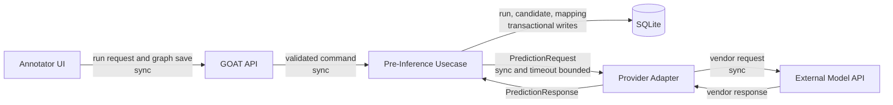
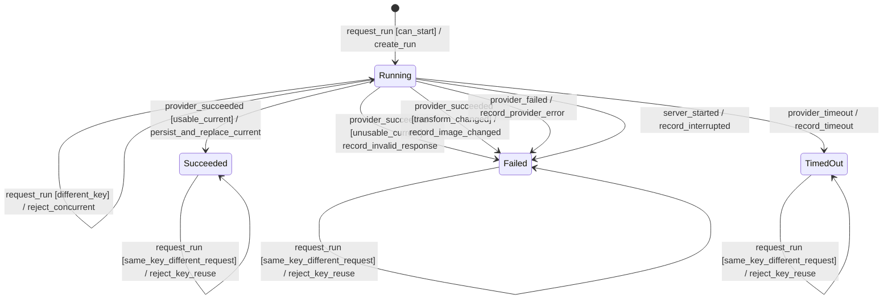
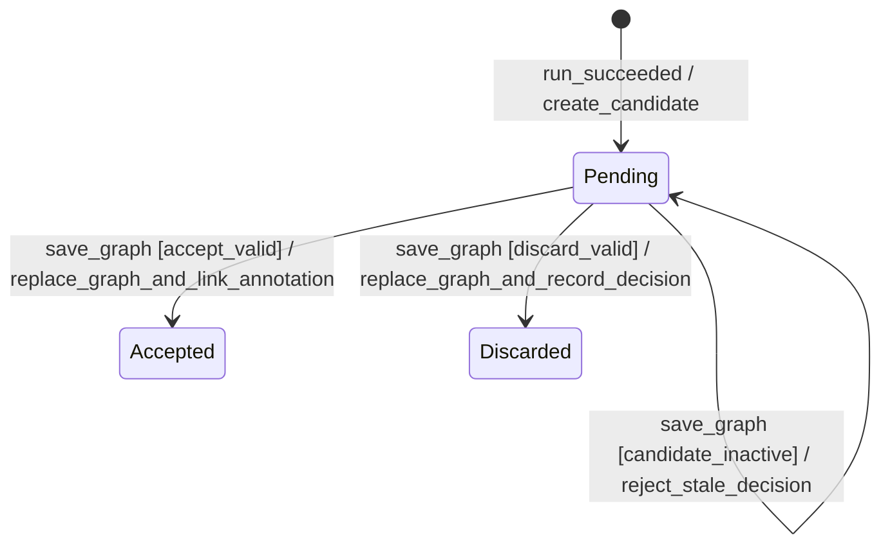

# Pre-Inference Integration Specification

## Scope

Pre-Inferenceは、外部モデルの出力をAnnotationの候補として提示し、Annotatorによる確認後に通常のAnnotationへ変換する機能である。
モデル出力は正解データではなく、手作業を開始するための提案として扱う。

この仕様は次の境界を定める。

- GOATとInference Providerの間で交換するベンダー非依存データ
- Inference RunとCandidateの永続化
- 外部LabelとGOAT LabelDefinitionの対応
- Candidateの採用、修正、破棄
- timeout、Providerエラー、部分的に不正な応答、重複要求、再実行
- Annotation Graph保存との整合性

モデルの精度比較、学習Pipeline、ジョブキュー、複数画像の一括推論は対象外とする。

## Terms

| Term | Definition |
|------|------------|
| **Inference Provider** | 特定のモデルAPIを呼び出し、ベンダー固有形式をGOATの形式へ変換するAdapter |
| **Inference Run** | 1つのImageに対する1回の推論要求と、その実行結果 |
| **Candidate** | 成功したInference Runから得たBBoxまたはPolygonの候補。採用されるまでAnnotationではない |
| **Current Run** | 現在のImage transformと一致する、supersedeされていない最新の成功Run |
| **Transform fingerprint** | `rotation`、`flip_h`、`flip_v`、変換後`width`、変換後`height`から作る座標空間の識別子 |
| **Label Mapping** | Providerの外部Label keyをProject内のLabelDefinitionへ対応付ける設定 |

## Decisions

| Topic | Decision |
|-------|----------|
| Provider境界 | Usecaseはベンダー非依存の`PredictionRequest`と`PredictionResponse`だけを扱い、認証と形式変換はAdapterへ隔離する |
| 画像入力 | Backendがtransformを適用した画像を生成し、Annotatorが見る座標空間と同じpixel dataをProviderへ渡す |
| 実行方式 | 最初の実装はImage単位の同期HTTP呼び出しとし、永続Runで結果と失敗を記録する |
| Candidate | Runとともに永続化するが、採用されるまでAnnotation tableへ書き込まない |
| 採用と修正 | CandidateをFrontendの編集中Graphへ新規Annotationとして追加し、Graph保存時にCandidate判断と一括確定する |
| Label Mapping | `(project_id, provider_id, model_id, external_label_key)`単位で明示的に設定し、名前の類似による自動対応は行わない |
| 再実行 | 新しい成功RunをCurrent Runにし、以前の未採用候補を操作対象から外す。採用済みAnnotationは変更しない |
| 重複要求 | Clientが`Idempotency-Key`を付け、同じkeyの要求ではProviderを再実行しない |
| 部分不正 | 有効Candidateを保存し、不正Itemをindex付きwarningへ変換する。ただし非空応答が全件不正ならRunを失敗させる |

## Component Boundary



GOAT APIへ送る`provider_id`と`model_id`は、起動時に登録された設定だけを参照できる。
利用者が任意のURLや認証情報をRun要求へ埋め込む形式にはしない。
これにより、SSRFの入口と認証情報の永続化を避ける。

## Provider Contract

### Prediction Request

Provider Adapterは、次の論理Schemaを入力として受け取る。
Generic HTTP Adapterは`metadata` JSON partと`image` binary partを持つ`multipart/form-data`へ変換する。

```jsonc
{
  "request_id": "0194...",
  "image": {
    "id": "0194...",
    "filename": "invoice_001.png",
    "mime_type": "image/png",
    "width": 3508,
    "height": 2480,
    "transform_fingerprint": "sha256:..."
  },
  "project": {
    "id": "0194...",
    "labels": [
      {
        "id": "0194...",
        "name": "header",
        "category": "object"
      }
    ]
  },
  "model": {
    "provider_id": "local-detection",
    "model_id": "invoice-layout-v1"
  }
}
```

`image` binaryは`flip_h`、`flip_v`、時計回り`rotation`を適用した後のpixel dataである。
画像は常に変換後の`width`と`height`を持ち、Candidate座標はこの画像に対して正規化する。
ProviderがLabel一覧を利用しない場合も、Adapter境界では同じRequestを受け取り、必要な項目だけをベンダー要求へ写す。

Transform fingerprintは、field順を固定した次のUTF-8 JSONをSHA-256でhashし、hex値へ`sha256:`を付ける。

```json
{"rotation":90,"flip_h":false,"flip_v":true,"width":3508,"height":2480}
```

### Prediction Response

Provider Adapterはベンダー応答を次の論理Schemaへ変換する。

```jsonc
{
  "model_version": "2026-07-24.1",
  "predictions": [
    {
      "external_id": "detection-42",
      "type": "bbox",
      "coordinates": {
        "x": 0.10,
        "y": 0.20,
        "width": 0.30,
        "height": 0.05
      },
      "confidence": 0.94,
      "external_label": {
        "key": "0",
        "name": "header"
      }
    },
    {
      "external_id": "detection-43",
      "type": "polygon",
      "coordinates": {
        "points": [
          { "x": 0.10, "y": 0.20 },
          { "x": 0.40, "y": 0.20 },
          { "x": 0.40, "y": 0.30 }
        ]
      },
      "confidence": null,
      "external_label": {
        "key": "table",
        "name": "Table"
      }
    }
  ]
}
```

`external_id`はRun内で一意とする。
ベンダーがIDを返さない場合、Adapterが応答Itemの順序からRun内IDを生成する。
`model_version`は空白ではない文字列を必須とする。
`confidence`は省略可能な値であり、存在する場合は有限な`0.0`以上`1.0`以下とする。
BBoxとPolygonの座標検証は確定Annotationと同じ規則を使う。
`external_label.key`はProviderとmodel内で安定した識別子とし、表示名を対応付けのkeyに使わない。

AdapterはProvider固有の追加fieldをDomainへ渡さない。
GOATはnormalized prediction、model version、warningだけを保存し、認証情報と未加工の応答bodyは保存しない。

### Response Conversion

Provider応答の変換は履歴に依存しないため、状態機械ではなく表で定義する。

| Provider response | Run result | Current Run replacement |
|-------------------|------------|-------------------------|
| top-level Schemaが正しく、`predictions`が空配列 | `succeeded`。Candidateは0件 | 実行する |
| 有効Itemだけを含む | `succeeded`。全ItemをCandidateとして保存 | 実行する |
| 有効Itemと不正Itemを含む | `succeeded`。有効Itemを保存し、不正Itemをindex付きwarningへ記録 | 実行する |
| `predictions`が非空だが全Itemが不正 | `failed`、`invalid_response` | 実行しない |
| top-level Schema不正、JSON不正、上限超過 | `failed`、`invalid_response` | 実行しない |

Candidate件数と応答byte数の上限はProvider設定で必須とする。
上限を超えた応答は黙って切り詰めず、`invalid_response`として失敗させる。

## Persistence

### Inference Run

Inference Runは少なくとも次の値を保持する。

- Run ID、Image ID、Project ID
- `provider_id`、`model_id`、`model_version`
- `idempotency_key`と要求内容のhash
- `status`: `running`、`succeeded`、`failed`、`timed_out`
- transform fingerprintと変換後の`width`、`height`
- error code、利用者向けerror message、warning一覧
- 開始時刻と完了時刻
- 後続Runに置換された場合の`superseded_by_run_id`

### Candidate

Candidateは少なくとも次の値を保持する。

- Candidate ID、Run ID、Image ID
- Run内の`external_id`
- shape typeと正規化座標
- `confidence`
- `external_label_key`と`external_label_name`
- Run開始時のMapping集合から解決した`mapped_label_id`のsnapshot。未対応なら`null`
- `state`: `pending`、`accepted`、`discarded`
- 採用後の`accepted_annotation_id`と判断時刻

`accepted_annotation_id`はAnnotation削除後も由来を追えるように論理参照として保持する。
採用後にAnnotationを編集または削除しても、Candidateのshape、confidence、外部Labelは変更しない。

### Label Mapping

Label Mappingは`(project_id, provider_id, model_id, external_label_key)`を一意keyとし、同じProjectのLabelDefinition IDを参照する。
LabelDefinitionの名前が一致しても自動対応しない。
同名異義のLabelや表記変更を誤って確定Annotationへ持ち込むためである。

Run開始時にMapping集合を読み取り、成功結果からCandidateを保存するときに対応先をsnapshotする。
Mappingを後から変更しても既存Candidateは書き換えず、利用者は採用時に別のLabelDefinitionを選べる。
Run実行中に対応先Labelが削除された場合は保存時に`null`とし、新しいLabelを選ぶまで採用できない。

## Inference Run Lifecycle



| Guard | Condition |
|-------|-----------|
| `can_start` | keyが未使用であり、workflowがGraph編集を許可し、同じImageにrunning Runがない |
| `same_key_same_request` | 同じImage、key、request hashのRunが存在する |
| `same_key_different_request` | 同じImageとkeyでrequest hashが異なるRunが存在する |
| `different_key` | 同じImageに別keyのrunning Runが存在する |
| `usable_current` | transform fingerprintが開始時と一致し、Provider応答が成功条件を満たす |
| `unusable_current` | transform fingerprintが開始時と一致し、Provider応答が失敗条件を満たす |
| `transform_changed` | 現在のtransform fingerprintがRun開始時と異なる |

Run要求はImage workflowでAnnotation Graphを編集できる状態（`pending`または`rejected`かつ`escalated: false`）に限る。
同じ`Idempotency-Key`と同じ要求内容の再送は既存Runを返し、Providerを再実行しない。
同じkeyで要求内容が異なる場合は`409 Conflict`を返す。
別keyのRunが`running`の場合も`409 Conflict`を返し、Imageごとに同時実行を1件へ制限する。

成功時だけ、同じImageのsupersedeされていない以前の成功Runへ`superseded_by_run_id`を設定する。
失敗またはtimeoutでは以前のCurrent RunとCandidateを表示対象に残す。
明示的なRetryは新しい`Idempotency-Key`で新しいRunを作る。

Provider呼び出し中にImage transformが変わった場合、応答座標は現在のCanvasと一致しない。
Runを`failed`、error code `image_changed`として保存し、Candidateを保存せず`409 Conflict`を返す。

Server起動時に残っている`running` Runは、完了させる実行主体が存在しない。
起動処理はこれらを`failed`、error code `interrupted`へ更新してからRequestを受け付ける。
同じkeyの再送はこの失敗Runを返し、再実行には新しいkeyを要求する。

## Candidate Lifecycle

Frontendの`staged_accept`、`staged_edit`、`staged_discard`は未保存のUI stateであり、永続状態には追加しない。



| Guard | Condition |
|-------|-----------|
| `accept_valid` | Candidateが操作可能であり、同じRequest内の新規Annotationを1つ参照する |
| `discard_valid` | Candidateが操作可能であり、Annotationを参照しない |
| `candidate_inactive` | CandidateがCurrent Runに属さない、transformが異なる、または`pending`ではない |

`accept`はCandidateの座標とmapped Labelを持つ新規Annotationを編集中Graphへ追加する。
`edit`は同じ新規Annotationを追加した後、保存前に座標またはLabelを変更する操作である。
したがって永続層では`accept`と`edit`を別状態に分けず、保存されたAnnotationの値がCandidateと異なるかどうかだけが残る。

`discard`はCandidateをCanvasから即座に隠せるが、保存まではFrontendのstaged decisionに留める。
Graph保存に失敗した場合、Server上のCandidateは`pending`のままとし、Frontendは編集中Graphとstaged decisionを保持する。

`accepted`と`discarded`は終端状態であり、別の判断へ戻さない。
採用後のAnnotationは通常のAnnotationとして編集できる。

## Atomic Graph Save

`PUT /images/:imageId/graph`へ`candidate_decisions`を追加し、Annotation、Edge、Candidate判断を1つのDB Transactionで保存する。

```jsonc
{
  "annotations": [
    {
      "client_id": "candidate-annotation-1",
      "id": "",
      "type": "bbox",
      "coordinates": { "x": 0.1, "y": 0.2, "width": 0.3, "height": 0.05 },
      "label_id": "0194..."
    }
  ],
  "edges": [],
  "candidate_decisions": [
    {
      "candidate_id": "0196...",
      "decision": "accept",
      "annotation_client_id": "candidate-annotation-1"
    },
    {
      "candidate_id": "0197...",
      "decision": "discard"
    }
  ]
}
```

保存時は次の条件をすべて検証し、状態に依存する条件はTransaction内でも再確認してから書き込みを始める。

- Candidateが同じImageに属する
- CandidateがCurrent Runに属し、transform fingerprintが現在のImageと一致する
- Candidateが`pending`である
- 同じCandidateへの判断がRequest内で重複しない
- `accept`が参照する`annotation_client_id`は同じRequest内の新規Annotationである
- 1つの新規Annotationを複数Candidateの採用先にしない
- 採用先AnnotationのLabelDefinitionが同じProjectに存在する
- `discard`は`annotation_client_id`を持たない

`candidate_decisions`の省略または空配列は「Candidate判断なし」を意味し、通常のGraph編集ではCandidate状態を変更しない。
Candidate判断だけを即時確定する別APIは設けない。
別Transactionにすると、Candidateだけが`accepted`になり、対応するAnnotationが保存されない状態を作れるためである。

Run成功処理とGraph保存処理は、同じImageのCurrent RunとCandidate stateを同じDB Transaction内で条件付き更新する。
Run成功が先にCommitした場合、古いRunのCandidate判断は`409 Conflict`となる。
Graph保存が先にCommitした場合、採用済みAnnotationは後続Runが成功しても残る。

## Transform Changes

Inference Runは実行時のtransform fingerprintを保持する。
Imageのrotationまたはflipが変わりfingerprintが一致しなくなったRunはCurrent Runではなくなり、そのCandidateを表示または採用できない。

transform更新時にCandidateを別Transactionで一括変更しない。
Image更新だけが成功してCandidate更新が失敗する部分更新を避け、座標空間の一致を読み取りとGraph保存のguardで保証する。
新しいtransformでRunが成功したとき、同じImageのsupersedeされていない以前の成功Runをsupersedeする。

## Public API Behavior

公開EndpointとJSON Schemaは[API Design](api.md#pre-inference)を正本とする。
この仕様では次の操作境界だけを定める。

- 設定済みProviderとmodelの一覧取得
- Image単位のRun開始とRun結果取得
- ImageのCurrent RunとCandidate一覧取得
- Project単位のLabel Mapping取得と一括更新
- Graph保存によるCandidate判断の確定

Provider呼び出しは設定されたtimeoutまで同期的に待つ。
timeoutはRunを`timed_out`として保存して`504 Gateway Timeout`を返し、ProviderのHTTPまたは接続失敗は`failed`として保存して`502 Bad Gateway`を返す。
Client切断で呼び出しがcancelされた場合もRunを`failed`として記録し、次の試行には新しいkeyを要求する。
このRunのerror codeは`client_cancelled`とし、同じkeyが再送された場合は`409 Conflict`を返す。

## Event Contract

| Event | Producer | Consumer | Sync | Payload | Result |
|-------|----------|----------|------|---------|--------|
| `request_run` | Annotator UI | GOAT API | sync、idempotent by key | Image ID、provider ID、model ID、key | terminal Runまたは実行中Run |
| `provider_succeeded` | Provider Adapter | Pre-Inference Usecase | sync | normalized response | Candidate保存またはinvalid response |
| `provider_failed` | Provider Adapter | Pre-Inference Usecase | sync | classified error | failed Run |
| `provider_timeout` | timeout boundary | Pre-Inference Usecase | sync | Run ID | timed out Run |
| `save_graph` | Annotator UI | Image Graph Usecase | sync、atomic | GraphとCandidate判断 | persisted Graphとterminal Candidate判断 |

## Design Notes

- **直積崩れの扱い**：Runの実行状態とCandidateの判断状態を別Entityへ分ける。Candidateが操作可能かどうかはCurrent Runとtransform fingerprintのguardで制限する。
- **broadcastの対応**：同じeventを複数の直交領域へ配信する処理はない。
- **guardの根拠**：workflow state、Run state、Candidate state、Image ID、Project ID、transform fingerprintはすべて保存前のServer stateとRequestだけを参照する。
- **アクションの冪等性**：Run開始は`Idempotency-Key`で冪等化する。Graph保存は全置換とCandidateの終端遷移を1 Transactionで行い、失敗時は全変更をrollbackする。
- **未定義eventの扱い**：状態、guard、入力Schemaに一致しない操作は`400 Bad Request`または`409 Conflict`とし、状態を変更しない。
- **異常系の範囲**：Provider失敗、timeout、Client cancel、部分不正、全件不正、同時実行、重複key、stale transform、Graph保存失敗を定義した。
- **既知の未対応ケース**：複数画像のbatch、Run cancel API、推論進捗、CandidateからのEdge生成、Provider側の再試行は最初の実装に含めない。
- **共有状態の排他制御**：Imageごとのrunning Run一意制約と、Run成功およびGraph保存Transaction内の条件付き更新で競合を制限し、Frontendのbutton無効化だけには依存しない。

## Alternatives

### Provider固有形式をUsecaseへ渡す

却下する。
Providerを追加するたびにDomain、Handler、Frontendへvendor fieldが広がり、Candidateの検証規則を一箇所に保てない。

### 画像URLだけをProviderへ渡す

却下する。
ローカル実行のGOATへ外部Providerから到達できず、presigned URLを導入すると初期スコープにクラウドストレージが必要になる。
Generic HTTP Adapterは変換済み画像binaryを送る。

### CandidateをFrontendだけに保持する

却下する。
reloadで候補と判断途中の状態を失い、重複要求の抑止、model versionの記録、採用Annotationの由来をServerで検証できない。

### 採用時にAnnotation作成APIを即時実行する

却下する。
現在のAnnotatorはAnnotationとEdgeをImage Graphとして一括保存しており、候補採用だけを先にCommitすると未保存GraphとServer Graphが分岐する。

### 古いCandidateと新しいCandidateを同時に操作可能にする

却下する。
同一領域の重複候補をRun世代ごとに比較するUIと競合規則が必要になり、最初の手作業支援に対して複雑さが大きい。
履歴は保持するが、操作対象はCurrent Runだけにする。

### 最初から非同期Job Queueを導入する

却下する。
Image単位のMVPでは永続Worker、再配送、進捗通知の運用負荷が先に発生する。
同期呼び出しでtimeoutが実作業を妨げることが計測できた場合に、同じRunとCandidateの契約を保ったまま実行方式を変更する。

## Implementation Order

実装は次の依存順で分割する。

1. [Issue #41](https://github.com/daikichiba9511/goat-cv/issues/41): Inference Run、Candidate、Label MappingのDomainと永続化
2. [Issue #42](https://github.com/daikichiba9511/goat-cv/issues/42): Provider非依存Run service、公開API、idempotency、失敗分類
3. [Issue #43](https://github.com/daikichiba9511/goat-cv/issues/43): Image Graph保存へのCandidate判断Transaction追加
4. [Issue #44](https://github.com/daikichiba9511/goat-cv/issues/44): AnnotatorのCandidate表示、Label選択、採用、修正、破棄
5. [Issue #45](https://github.com/daikichiba9511/goat-cv/issues/45): Generic HTTP Provider Adapterと設定検証

各Issueは実装内部ではなく、状態遷移、HTTP結果、永続化結果、UI操作結果として観測できる振る舞いをテストする。

## References

- [Label Studio: Import pre-annotations into Label Studio](https://labelstud.io/guide/predictions.html)
- [Label Studio: Integrate Label Studio into your machine learning pipeline](https://labelstud.io/guide/ml.html)
- [CVAT: Automatic annotation](https://docs.cvat.ai/docs/annotation/auto-annotation/automatic-annotation/)
- [Roboflow Inference: InferencePipeline](https://inference.roboflow.com/using_inference/inference_pipeline/)

Label Studioはpredictionを確定annotationと分け、利用者がcopyして編集する境界を採っている。
CVATはmodel labelとtask labelの明示的な対応、および再実行時に既存annotationを削除するかどうかの選択を持つ。
GOATはこれらを参考にしつつ、Candidateを永続化し、既存Annotationを再実行で削除しない契約を選んだ。
