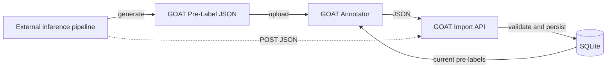
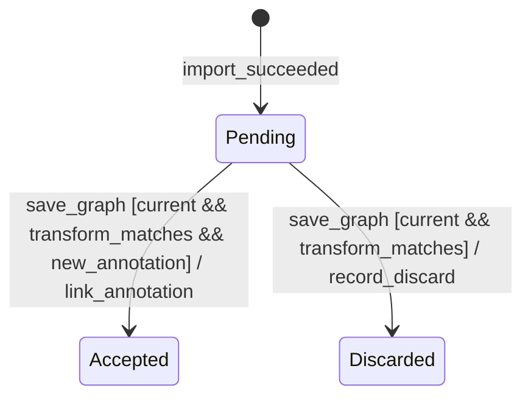

# Pre-Label Import Specification

## Purpose

Pre-Label Importは、外部で生成済みの推論結果をGOATへ取り込む機能である。
Annotatorが確認した結果だけを通常のAnnotationへ変換する。
GOATはモデルを実行せず、推論結果を受け取るところから責務を持つ。

この仕様は次の振る舞いを定義する。

- Project単位のGOAT Pre-Label JSON
- PreLabelImportとPreLabelの永続化
- 外部LabelとGOAT LabelDefinitionの扱い
- 事前ラベルの採用、修正、破棄
- 再取り込み、Image transform変更、workflow制約
- Image Graphと事前ラベル判断の原子的な保存

## Non-Goals

次の機能はGOATへ実装しない。

- モデルのアップロード、選択、実行
- 外部モデルAPIやInference ProviderへのHTTP通信
- Provider endpoint、認証情報、timeout、retryの管理
- 推論用画像の生成と送信
- 推論jobの進捗、cancel、再配送
- モデルの学習、評価、精度比較

COCO、YOLO、Vendor固有形式の直接Importも最初の実装には含めない。
外部処理は推論結果をGOAT Pre-Label JSONへ変換してから取り込む。

## Terms

| Term | Definition |
|------|------------|
| **PreLabelImport** | 1回のProject単位Importと、その取り込み元および作成時刻を保持する記録 |
| **PreLabelImportImage** | Importに含まれたImageとcoordinate spaceを保持する記録。PreLabelが0件でも作成する |
| **PreLabel** | 外部で生成されたBBoxまたはPolygon。利用者が採用するまでAnnotationではない |
| **Source Label** | 外部結果に含まれるLabelの識別子と表示名 |
| **Mapped Label** | PreLabelへ任意で対応付けたProject内のLabelDefinition |
| **Current Pre-Labels** | あるImageを最後に正常に取り込んだImportに属し、現在のtransformと一致するPreLabel集合 |

## Responsibility Boundary



GOAT Backendから外部Pipelineへ向かう通信は存在しない。
HTTP APIは生成済みJSONのImportと保存済みPreLabelの取得だけを公開する。

## Import Format

最初の形式は`goat_pre_labels` version `1.0`とする。
1つのFileで同じProjectに属する複数Imageを扱える。

```jsonc
{
  "format": "goat_pre_labels",
  "version": "1.0",
  "source": {
    "name": "layout-detector",
    "version": "2026-07-24.1",
    "reference": "batch-2026-07-24"
  },
  "images": [
    {
      "image_id": "0194...",
      "coordinate_space": {
        "width": 2480,
        "height": 3508,
        "rotation": 0,
        "flip_h": false,
        "flip_v": false
      },
      "items": [
        {
          "external_id": "detection-42",
          "type": "bbox",
          "coordinates": {
            "x": 0.10,
            "y": 0.20,
            "width": 0.30,
            "height": 0.05
          },
          "confidence": 0.94,
          "source_label": {
            "key": "0",
            "name": "header"
          },
          "label_id": "0195..."
        },
        {
          "external_id": "detection-43",
          "type": "polygon",
          "coordinates": {
            "points": [
              { "x": 0.50, "y": 0.20 },
              { "x": 0.75, "y": 0.20 },
              { "x": 0.70, "y": 0.40 }
            ]
          },
          "confidence": null,
          "source_label": {
            "key": "1",
            "name": "table"
          },
          "label_id": null
        }
      ]
    }
  ]
}
```

### Top-Level Fields

| Field | Rule |
|-------|------|
| `format` | `goat_pre_labels`だけを受理する |
| `version` | 最初の実装では`1.0`だけを受理する |
| `source.name` | 前後の空白を除いた空でない文字列を必須とする |
| `source.version` | 省略または`null`を許可し、指定時は空でない文字列とする |
| `source.reference` | 省略または`null`を許可し、外部Pipeline側のbatchやartifactを識別する文字列として保存する |
| `images` | 1件以上を必須とし、同じ`image_id`を重複させない |

`source`は取り込み元の記録である。
GOATがそのモデルやPipelineを呼び出せることを意味しない。

### Image Fields

| Field | Rule |
|-------|------|
| `image_id` | URLで指定したProjectに属する既存Imageを必須とする |
| `coordinate_space.width` | 現在の変換後Image widthと一致する正の整数を必須とする |
| `coordinate_space.height` | 現在の変換後Image heightと一致する正の整数を必須とする |
| `coordinate_space.rotation` | 現在値と一致する`0`、`90`、`180`、`270`のいずれかを必須とする |
| `coordinate_space.flip_h` | 現在値と一致するbooleanを必須とする |
| `coordinate_space.flip_v` | 現在値と一致するbooleanを必須とする |
| `items` | 配列を必須とし、空配列を許可する |

`items: []`は、そのImageに対する正常な空の推論結果である。
取り込み成功後、そのImageのCurrent Pre-Labelsは空になる。

### PreLabel Fields

| Field | Rule |
|-------|------|
| `external_id` | 省略または`null`を許可する。指定時は同じImageの`items`内で一意な空でない文字列とする |
| `type` | `bbox`または`polygon`を必須とする |
| `coordinates` | Annotationと同じ正規化座標Schemaを必須とする |
| `confidence` | 省略または`null`を許可する。指定時は`0.0`以上`1.0`以下の有限値とする |
| `source_label.key` | 省略または`null`を許可する。指定時は空でない文字列とする |
| `source_label.name` | 前後の空白を除いた空でない文字列を必須とする |
| `label_id` | 省略または`null`を許可する。指定時は同じProjectのLabelDefinition IDでなければならない |

BBoxとPolygonの座標規則は[GOAT Product Specification](spec.md#data-and-coordinate-rules)と同じである。
PreLabelの座標は`coordinate_space`が示す変換後画像に対する正規化値とする。

JSON decoderは未知field、必須fieldの欠落、1つのJSON値に続く余分な値を拒否する。
互換性のために未知versionや別Schemaを推測して受理しない。

## Import Validation

Importは全件を検証してから1つのDB Transactionで保存する。
Project内の複数Imageを含む場合も部分Importを行わない。

| Condition | HTTP status | Existing Current Pre-Labels |
|-----------|-------------|----------------------------|
| 全Imageと全PreLabelが有効 | `201 Created` | 取り込み対象Imageだけを置換する |
| Projectが存在しない | `404 Not Found` | 変更しない |
| JSON、format、version、座標、confidence、Labelが不正 | `400 Bad Request` | 変更しない |
| Imageが存在しないか別Projectに属する | `400 Bad Request` | 変更しない |
| Image transformが一致しない | `409 Conflict` | 変更しない |
| workflowがGraph編集を許可しないImageを含む | `409 Conflict` | 変更しない |
| DB保存が失敗する | `500 Internal Server Error` | 変更しない |

検証エラーは`images[index]`と必要な場合は`items[index]`を含める。
Importが一部だけ成功したように見える状態は許可しない。
不正Itemだけを警告として読み飛ばさず、Request全体を拒否する。

## Label Handling

Source Labelは外部結果の表示と由来確認のためにそのまま保存する。
名前の一致だけでGOAT LabelDefinitionへ自動対応させない。

Import時の`label_id`は任意である。
`label_id`がないPreLabelも表示とdiscardはできる。
acceptする前にAnnotatorがGOAT LabelDefinitionを選ぶ必要がある。
利用者が選んだLabelは、PreLabel自体を書き換えず、採用時に作るAnnotationへ設定する。

Project単位の永続Label Mappingは最初の実装へ追加しない。
外部PipelineまたはJSON変換処理がGOAT Label IDを把握している場合だけ、`label_id`を含める。

対応先のLabelDefinitionを削除した場合、PreLabelの`label_id`は`null`に戻す。
Source Labelは保持し、Annotatorが別のLabelDefinitionを選ぶまでacceptを許可しない。

Imageを削除した場合は、そのImageのPreLabelImportImageとPreLabelを削除する。
Projectを削除した場合は、そのProjectのPreLabelImportを削除する。
配下のPreLabelImportImageとPreLabelも削除する。

## Decision State

PreLabelは確定Annotationとは別に、次の判断状態を持つ。



| State | Meaning | Can be decided |
|-------|---------|----------------|
| `pending` | まだ採用も破棄も保存されていない | Current Pre-Labelsである場合だけ可 |
| `accepted` | 新規Annotationと同じTransactionで採用された | 不可 |
| `discarded` | Graph保存と同じTransactionで破棄された | 不可 |

`edit`はPreLabelの状態ではない。
AnnotatorはPreLabelから新規Annotationを作る。
座標またはLabelをローカルで変更してから、`accept`として保存できる。
これにより、取り込んだ元の座標、Source Label、confidenceを変更せずに由来を残せる。

## Current Pre-Labels and Re-Import

あるImageのCurrent Pre-Labelsは、そのImageを含む最後の正常なPreLabelImportに属する。
そのImportのcoordinate spaceは現在のtransformと一致しなければならない。

再取り込みは次の規則に従う。

- 成功したImportは、`images`に含まれるImageだけのCurrent Pre-Labelsを置換する
- `images`に含まれないImageのCurrent Pre-Labelsは変更しない
- `items: []`を持つImageはCurrent Pre-Labelsを空にする
- 以前のImportに属する`pending` PreLabelはCurrentではなくなり、以後は判断できない
- 以前に採用したAnnotationは削除または変更しない
- 以前の`accepted`と`discarded`は判断の由来として保持する
- Importに失敗した場合はすべてのImageでCurrent Pre-Labelsを変更しない

同じFileを再度取り込んだ場合も新しいPreLabelImportとして扱う。
表示対象は各ImageのCurrent Pre-Labelsだけである。
同じ候補を複数のImportから同時に表示しない。

## Atomic Graph Save

PreLabelの判断は[Image Annotation Graph API](api.md#image-annotation-graph)で保存する。
AnnotationとEdgeも同じRequestとTransactionに含める。

`accept`は同じRequest内の新規Annotation `client_id`を参照する。
既存Annotationの参照は許可しない。
`discard`はAnnotationを参照しない。

次の条件を満たさないRequestは全体を拒否する。

- PreLabelが同じImageのCurrent Pre-Labelsに属する
- PreLabelが`pending`である
- Import時のcoordinate spaceが現在のImage transformと一致する
- `accept`が参照するAnnotationは同じRequest内の新規Annotationである
- 採用するAnnotationは同じProjectのLabelDefinitionを持つ
- 1つのAnnotationを複数PreLabelの採用先に使わない

Graph検証、PreLabel判断の検証、DB保存のいずれかが失敗した場合はRequest全体を拒否する。
Annotation、Edge、PreLabelのすべてを変更しない。
Serverへ保存できる前のaccept、edit、discardはFrontendのstaged stateにとどめる。

## Transform and Workflow

Importと判断保存は、対象ImageのworkflowがAnnotation Graph編集を許可する場合だけ実行できる。
許可規則は[Image Workflow Status Specification](workflow-status.md#許可操作)を正本とする。

Import後にrotationまたはflipが変わった場合、そのPreLabelはCurrentではなくなる。
Canvasへ操作可能な事前ラベルとして表示しない。
transform変更前のPreLabelを自動変換しない。
外部Pipelineが新しいcoordinate spaceで結果を生成し、再度Importする。

## Public API

公開EndpointとResponse Schemaは[API Design](api.md#pre-label-import)を正本とする。

- Project単位のPreLabelImport作成
- Image単位のCurrent Pre-Labels取得
- Image Graph保存に含めるPreLabel判断

モデル一覧、Provider一覧、Inference Run実行Endpointは公開しない。

## Behavior Scenarios

実装テストは内部関数を対象にしない。
次の観測可能な振る舞いから必要十分な組み合わせを選ぶ。

1. 有効なProject単位JSONを取り込み、各ImageからCurrent Pre-Labelsを取得できる
2. 1件の不正なImageまたはPreLabelを含むImportは全件拒否され、既存状態が変わらない
3. 再取り込みは対象Imageだけを置換し、省略したImageと既存Annotationを変更しない
4. `items: []`は正常な空結果として対象ImageのCurrent Pre-Labelsを空にする
5. transform不一致またはworkflow制約ではImportも判断保存も拒否される
6. acceptまたはdiscardはGraphと同時に保存され、失敗時はどちらも変更されない
7. GOAT Labelが未対応のPreLabelは取り込めるが、Labelを持つAnnotationへ変換するまで採用できない

同じ規則をRepository、Usecase、Handlerで重複して網羅しない。

- Repository testはTransactionと永続化契約を確認する
- HTTP testは公開Schemaと層をまたぐ代表経路を確認する
- Frontend testは利用者が観測できる操作結果を確認する

## Rejected Alternatives

### GOATからモデルAPIを呼び出す

この方式ではendpoint、認証、timeout、retry、画像変換、実行状態がGOATの責務になる。
GOATの目的はアノテーション作業であり、推論基盤の運用ではないため採用しない。

### 外部結果を通常のAnnotationとして直接Importする

この方式では推論結果が確認前に確定データとなる。
利用者が採用、修正、破棄する境界を表現できない。
外部結果はPreLabelとして分離して保存する。

### PreLabelをFrontendだけに保持する

この方式ではreload後に事前ラベルと判断を復元できない。
Graph保存失敗時の原子性も保証できない。
PreLabelImportとPreLabelをBackendへ永続化する。

## Implementation Issues

実装は依存順に次のIssueへ分割する。

1. [Issue #48](https://github.com/daikichiba9511/goat-cv/issues/48): Project単位Import APIとPreLabel永続化
2. [Issue #49](https://github.com/daikichiba9511/goat-cv/issues/49): PreLabel判断とImage Graphの原子的保存
3. [Issue #50](https://github.com/daikichiba9511/goat-cv/issues/50): AnnotatorのImportとPreLabel操作
