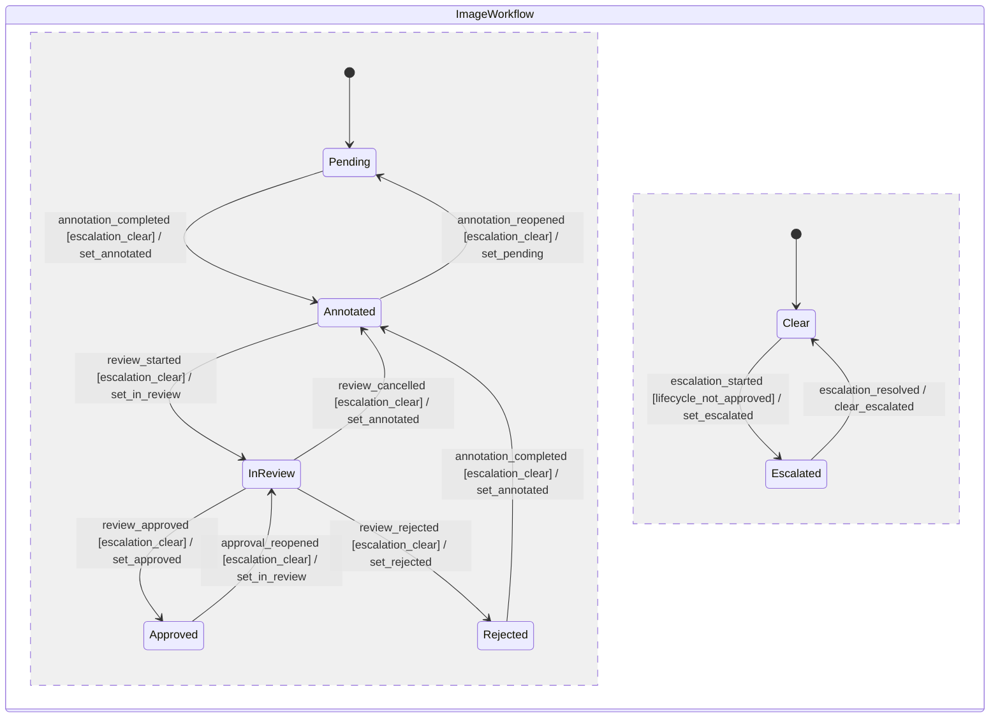

# Image Workflow Status Specification

## 対象

この仕様は、Image単位のアノテーション作業、レビュー、差戻し、承認、エスカレーションの振る舞いを定義する。
認証とRole制御は対象外であり、初期実装では同じ利用者がすべてのeventを実行できる。

## 状態

Image workflowは、作業段階を表す**lifecycle**と、判断待ちを表す**escalation**の二つの直交領域で構成する。
エスカレーションをlifecycleへ含めないため、解除時に復帰先を保存する必要はない。

| 領域 | 永続化フィールド | 状態 | 意味 |
|------|------------------|------|------|
| lifecycle | `status` | `pending` | Annotation Graphを作成または修正している |
| lifecycle | `status` | `annotated` | Annotation Graphの作業を完了し、レビュー依頼前または依頼可能である |
| lifecycle | `status` | `in_review` | Annotation Graphをレビューしている |
| lifecycle | `status` | `rejected` | レビューで差し戻され、修正と再提出を待っている |
| lifecycle | `status` | `approved` | レビューで承認された |
| escalation | `escalated` | `false` | 通常のworkflow操作を実行できる |
| escalation | `escalated` | `true` | 判断待ちであり、lifecycle遷移とGraph変更を停止している |

新規Imageは`status: pending`かつ`escalated: false`で開始する。
`rejected`は永続状態であり、修正中も維持し、再提出時に`annotated`へ遷移する。
`approved`と`escalated: true`の組合せは禁止する。
Annotation単位の懸念はCommentとして記録し、Image全体の作業を止める必要がある場合だけImageを`escalated: true`へ遷移させる。

## 決定理由

CVATは作業のstageとstateを分け、`rejected`を修正が必要な継続状態として扱っている。
GOATも差戻し対象を一覧から追跡できるように`rejected`を永続状態とし、判断待ちは作業段階と意味が異なるためescalation領域へ分離する。
参考にしたCVATの仕様は[Task creation](https://docs.cvat.ai/docs/manual/basics/create-annotation-task/)、[Annotation editor navigation](https://docs.cvat.ai/docs/annotation/annotation-editor/navbar/)、[Manual QA](https://docs.cvat.ai/docs/qa-analytics/manual-qa/)である。

`escalated`をlifecycle statusへ含めて直前のstatusを別フィールドに保存する案は、遷移のたびに二つの値の整合性を維持する必要があるため採用しない。
未解決Commentからescalationを導出する案は、QA記録とImage全体の作業停止を同じ意味にしてしまうため採用しない。

## 状態機械



`escalation_resolved`はlifecycleを変更しない。
したがって、解除後のlifecycleは`escalation_started`前と同じ状態になる。

## Event

| Event | 遷移元 | 遷移先 | 意味 |
|-------|--------|--------|------|
| `annotation_completed` | `pending`、`rejected` | `annotated` | 初回作業または差戻し修正を完了する |
| `annotation_reopened` | `annotated` | `pending` | レビュー依頼前のImageを再編集する |
| `review_started` | `annotated` | `in_review` | レビューを開始する |
| `review_cancelled` | `in_review` | `annotated` | 承認または差戻しを行わずレビューを取り消す |
| `review_approved` | `in_review` | `approved` | レビュー結果を承認する |
| `review_rejected` | `in_review` | `rejected` | 修正が必要な状態として差し戻す |
| `approval_reopened` | `approved` | `in_review` | 承認後に見つかった問題を再レビューする |
| `escalation_started` | `pending`、`annotated`、`in_review`、`rejected`かつ`escalated: false` | lifecycleを維持して`escalated: true` | 判断待ちとして通常操作を停止する |
| `escalation_resolved` | `escalated: true` | lifecycleを維持して`escalated: false` | 判断待ちを解除する |

## 許可操作

Commentの作成、一覧、解決状態の更新、削除と、Imageの閲覧、Exportはすべての状態で許可する。
認証導入前のため、eventの実行可否をRoleでは制限しない。

| lifecycle | `escalated` | Annotation Graphの変更 | transformの変更 | 許可event |
|-----------|-------------|------------------------|-------------------|-----------|
| `pending` | `false` | 許可 | 許可 | `annotation_completed`、`escalation_started` |
| `annotated` | `false` | 拒否 | 拒否 | `annotation_reopened`、`review_started`、`escalation_started` |
| `in_review` | `false` | 拒否 | 拒否 | `review_cancelled`、`review_approved`、`review_rejected`、`escalation_started` |
| `rejected` | `false` | 許可 | 拒否 | `annotation_completed`、`escalation_started` |
| `approved` | `false` | 拒否 | 拒否 | `approval_reopened` |
| `pending`、`annotated`、`in_review`、`rejected` | `true` | 拒否 | 拒否 | `escalation_resolved` |

Graphまたはtransformの変更を拒否する場合、既存データを変更せず`409 Conflict`を返す。
transformはAnnotation座標全体を無効にし得るため、初回作業を完了した後は許可しない。

## Clientの遷移順序

Clientが未保存のAnnotation Graphを保持している状態で`annotation_completed`を実行する場合、Graph保存が成功してからworkflow eventを送信する。
`pending`または`rejected`から`escalation_started`を実行する場合も、未保存のGraphがあれば先に保存する。
Graph保存に失敗した場合はworkflow eventを送信せず、編集内容と現在状態を維持して保存エラーを表示する。
workflow eventが失敗した場合は保存済みGraphを戻さず、serverから再取得したworkflow状態と許可eventを表示する。

## API応答

未知のeventは、リクエスト形式の誤りとして`400 Bad Request`を返す。
既知のeventでも現在状態から許可されない場合は、状態競合として`409 Conflict`を返す。
対象Imageが存在しない場合は`404 Not Found`を返す。

`409 Conflict`のresponseは現在状態と許可eventを返し、clientが再読込後に次の操作を選べるようにする。

```json
{
  "error": "workflow transition not allowed",
  "current": {
    "status": "approved",
    "escalated": false
  },
  "allowed_events": ["approval_reopened"]
}
```

## GuardとAction

| Guard | 条件 |
|-------|------|
| `escalation_clear` | `escalated`が`false`である |
| `lifecycle_not_approved` | `status`が`approved`ではない |

| Action | 更新 |
|--------|------|
| `set_pending` | `status`を`pending`に設定する |
| `set_annotated` | `status`を`annotated`に設定する |
| `set_in_review` | `status`を`in_review`に設定する |
| `set_rejected` | `status`を`rejected`に設定する |
| `set_approved` | `status`を`approved`に設定する |
| `set_escalated` | `escalated`を`true`に設定する |
| `clear_escalated` | `escalated`を`false`に設定する |

すべてのActionは値の設定だけを行う冪等操作である。
ただし、同じeventを遷移後に再送すると遷移元が一致しないため、APIは成功を再現せず`409 Conflict`を返す。

## 設計メモ

- **直積崩れの扱い**：lifecycleとescalationを直交領域へ分割する。`approved`かつ`escalated: true`は作らない禁止状態とし、それ以外の未記載遷移は遷移制限として扱う。
- **broadcastの対応**：なし。各eventはlifecycleまたはescalationの一方だけが消費する。
- **guardの根拠**：lifecycle eventは事前状態の`escalated`だけを参照し、判断待ち中の作業進行を防ぐ。`escalation_started`は事前状態の`status`だけを参照し、承認済みと判断待ちの矛盾を防ぐ。
- **Actionの冪等性**：すべて値設定であり累積更新はない。HTTP requestの再送結果はActionの冪等性とは分け、遷移後の再送を`409 Conflict`とする。
- **未定義eventの扱い**：未知のeventは`400 Bad Request`、既知だが未定義の状態event組は`409 Conflict`とする。暗黙のself-loopは作らない。
- **異常系のcoverage**：`review_cancelled`、`annotation_reopened`、`approval_reopened`を通常経路からの回復eventとして定義する。差戻しは`review_rejected`、判断待ちはescalation領域で扱う。timeoutと自動遷移はない。
- **既知の未対応ケース**：Role別の実行権限、状態遷移の監査履歴、複数clientによる同時更新、期限による自動遷移は初期実装に含めない。

## 実装分割

この仕様の実装は、永続化とUsecase、APIと変更guard、Annotator UIのIssueに分割する。
振る舞いテストは各Issueの受け入れ条件に含め、実装後にテストだけを追加するIssueへ分離しない。
各実装Issueはこの文書を振る舞いの正とし、実装都合でeventや許可遷移を追加しない。
